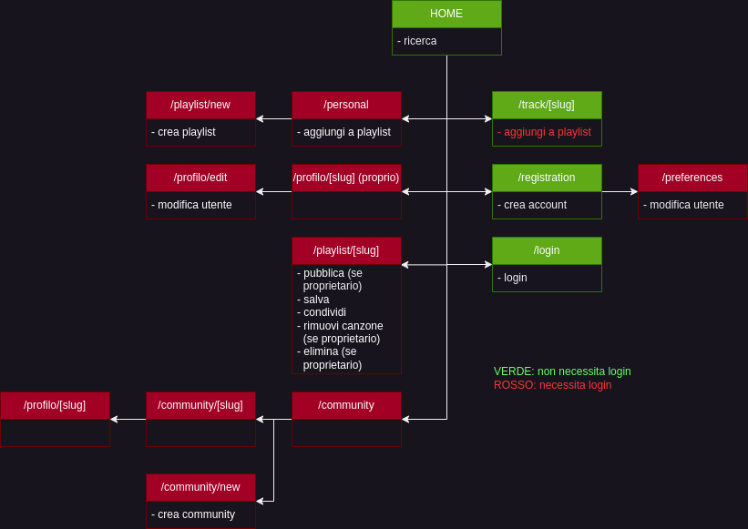

# Relazione

Progetto _"Social Network for Music (SNM)"_ di Provini Martina (02492A) e Zagheno Matteo (987403)

- [Installazione](#installazione)
- [Struttura del Progetto](#struttura-del-progetto)
  - [Frontend](#frontend)
  - [Backend](#backend)
  - [Organizzazione](#organizzazione)
- [Struttura del sito web](#struttura-del-sito)
- [Scelte implementative](#scelte-implementative)
  - [Autenticazione](#autenticazione)
  - [Token Spotify](#token-spotify)
  - [Gestione Community](#gestione-community)
- [Screenshots](#screenshots)
  
## Requisiti

Testato funzionare con Nodejs da versione 18^ e npm da versione 8^


## Installazione

### Backend

- Dalla cartella `backend` installare i moduli necessari con `npm install`
- Creare un file di configurazione `default.js` in `backend/config` sul modello di `default.example.js`
- Eseguire il comando `npm run start-gendoc` per generare la documentazione swagger
- Eseguire il comando `node app.js` per avviare il server

### Frontend
- Dalla cartella `frontend` installare i moduli necessari con `npm install`
- Eseguire il comando `npm run dev` per avviare il server

## Struttura del Progetto

## Frontend

Abbiamo utilizzato il framework sveltekit e per lo stile flowbite svelte e tailwind css

La parte di frontend è gestita con Svelte, un framework che permette di creare _componenti_ e costruire le pagine dinamicamente. La sua caratteristica principale è quella di svolgere la maggior parte del lavoro durante la fase di compilazione del codice, generando un'esperienza utente più leggera e performante.
Vite garantisce avvio veloce del server.
Grazie a Flowbite e Tailwindcss tutti i componenti dell'interfaccia sono reponsive ed adatti anche a dispositivi mobili.

## Backend

Il database utilizzato è MongoDB e le seguenti librerie sono state utilizzate nel backend:

- MongoClient
- Express
- Autenticazione: jsonwebtoken
- Password: bcrypt

## Organizzazione

Frontend:

- contiene i file di configurazione di svelte, tailwind, vite
- 'static': componenti statici per le pagine 
- 'src': contiene la paggina .html principale dell'applicazione
  - 'lib': componenti importabili per la costruzione delle pagine o l'utilizzo di funzioni javasciprt
  - 'routes': contiene la homepage e tutte le altre pagine del sito

Backend:

- lo swagger e l'app nodejs
- 'service': esporta funzionalità di gestione del sito
  - 'repositories': esporta funzionalità degli oggetti

## Struttura del sito



## Scelte implementative

### Autenticazione

Per l'autenticazione abbiamo scelto di utilizzare un token JWT. Questo token viene generato al momento del login e viene inviato al client. Il client dovrà poi inviare il token in ogni richiesta che richiede l'autenticazione. Il token ha una durata di 3 ore, dopodichè l'utente dovrà rieffettuare il login.

```javascript
async function login(req, res) {
  /*
      #swagger.tags = ["Authentication"]
      #swagger.description = "Login a user"
      #swagger.parameters['username'] = {description: "Username of the user to login", type: "string"}
      #swagger.parameters['password'] = {description: "Password of the user to login", type: "string"}
   */
  const errors = validationResult(req);
  if (!errors.isEmpty()) {
    return res.status(422).json({errors: errors.array()});
  } else {
    const data = matchedData(req);
    const username = data.username;
    const password = data.password;
    let userFromDb;
    await dataAccess.executeQuery(async (db) => {
      userFromDb = await db.collection('Users').findOne({
        username: username,
      });
    });
    if (userFromDb !== null && password !== null) {
      if (await compareHashed(password, userFromDb.password)) {
        return res.send({
          accessToken: generateAccessToken({
            _id: userFromDb._id.toString(),
            username: username
          }),
          name: username,
          profilePic: userFromDb.avatar,
          _id: userFromDb._id.toString()
        });
      }
    }

    return res.status(401).send({result: "Login non valido"});
  }
}

function generateAccessToken(user, expiringTime = 10800) {
  //console.log("expiration: ", expiringTime + 's');
  return jwt.sign(user, authSecret, {expiresIn: expiringTime + 's'});
}
```

### Token Spotify

Le richieste a spotify vengono effettuate tramite questa funzione, se la richiesta fallisce con un errore 401 viene effettuato il refresh del token e la richiesta viene ripetuta.

```javascript
async function get(url) {
    const res = await fetch(url, {
        headers: {
            "Content-Type": "application/json", Authorization: "Bearer " + apiToken,
        },
    });
    let jsonRes = await res.json();
    if (jsonRes?.error?.status === 401) { //token refresh
        console.log("refreshing token...");
        await refreshApiToken();
        return await (await fetch(url, {
            headers: {
                "Content-Type": "application/json", Authorization: "Bearer " + apiToken,
            },
        })).json()
    }
    return jsonRes;
}
```

La seguente funzione si occupa di refreshare il token e di aggiornare il token nel database e non in una configurazione locale per garantire una migliore sincronizzazione anche tra diverse macchine con un solo token.

```javascript
async function refreshApiToken() {
  await fetch(url, {
    method: "POST", headers: {
      Authorization: "Basic " + btoa(`${client_id}:${client_secret}`),
      "Content-Type": "application/x-www-form-urlencoded",
    }, body: new URLSearchParams({grant_type: "client_credentials"}),
  })
          .then((response) => response.json())
          .then((tokenResponse) => {
            apiToken = tokenResponse.access_token;
            console.log("tokenResponse: ", tokenResponse.access_token);
            dataAccess.executeQuery(async (db) => {
              await db.collection('Api').updateOne({_id: 0}, {$set: {spotifyApiToken: apiToken}});
            }).then(() => console.log("token updated on db"));
          });
}
```

### Gestione Community

Il concetto di cominutà e gruppi nelle piattaforme sociali può essere molto esteso. Noi abbiamo deciso di rendere le nostre community più un "luogo" che un gurppo, dove poter condividere le playlist di interesse (in maniera più simile a una chat). Di fatti l'unica funzionalità attiva a cui hanno accesso i membri del gruppo è `sharePlaylist`

```javascript
async function sharePlaylist(userId, communityId, playlistId) {
    let res;
    let community = await getCommunity(userId, communityId);
    if (community.error !== undefined) {
        return community;
    }
    community.sharedPlaylists.unshift({user: userId, playlist: playlistId})
    await dataAccess.executeQuery(async (db) => {
        res = await db.collection('Communities').updateOne({_id: new mongodb.ObjectId(communityId)}, {
            $set: {sharedPlaylists: community.sharedPlaylists}
        });
    });

    return res;
}
```

Tuttavia l'impostazione che abbiamo dato al progetto lascia apposta molti aggangi per espandere le funzionalità e rendere più interattivo il concetto di community di SNM

## Screenshots


